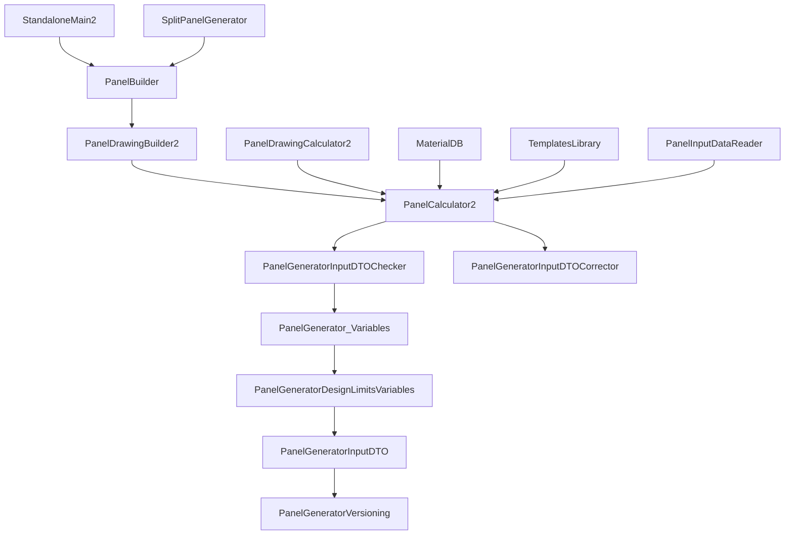

# Architecture documentation

The source of truth for dependencies is the `ProjectDependencies` sections in
`StandaloneMain2.sln`. Any diagram or prose must match it — read the `.sln` before
writing.

## Producing a dependency diagram (Mermaid)

Use a Mermaid `graph` so it renders in GitHub / Markdown viewers. Arrow points
from a project to what it depends on.

(`TestSuite` is independent of these tiers but drives `StandaloneMain2` end-to-end.)

## Guidance

- **Verify against the `.sln`.** If the graph and `ProjectDependencies` disagree,
  the `.sln` wins — update the doc, not your memory.
- Note the **languages**: `StandaloneMain2` and `PanelBuilder` are VB.NET; the rest
  are mostly C#. All target .NET Framework 4.8.
- Highlight the two anchors: `PanelGeneratorVersioning` (foundation) and
  `PanelCalculator2` (central hub).
- When dependencies change, update the diagram in the same change so docs never
  drift. Keep `CLAUDE.md`'s graph consistent with any doc you produce.
